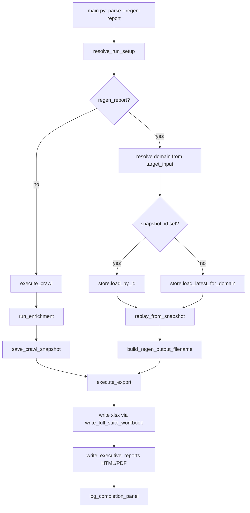

# Crawl Snapshot Persistence + Report-Only Regeneration Plan

Planning document for **Deliverable 1** (crawl snapshot persistence), **Deliverable 2** (`--regen-report` replay mode), and **Deliverable 3** (manual regression baseline workflow). No implementation in this document — implementation agents should follow the phases at the end.

---

## 1. Architecture decision

### Chosen approach: **Option B — SQLite with JSON-serialised rows** (`.cache/crawl_snapshots.sqlite`)

| Criterion | Option A (extended JSON files) | **Option B (SQLite)** | Option C (Parquet) |
|---|---|---|---|
| Indexed query (`latest for domain X`, list all) | Requires scanning/loading every file | Native SQL `ORDER BY` + indexes | Needs manifest maintenance |
| Retention (`keep last N per domain`) | Manual file deletion logic | `DELETE` with window functions / subquery | Manifest + file cleanup |
| Codebase precedent | Partial (`_delta_summary.json`) | **Strong** (`psi_cache.py`, `checkpoint/cache.py` AuditCache) | None |
| New dependencies | None | None (stdlib `sqlite3`) | Heavy (`pyarrow` / `polars`) |
| Large crawl payloads | Single huge file per run | Single blob per run (same scale); metadata queryable without deserialising rows | Most compact |
| WAL / concurrent access | File locking risk | `PRAGMA journal_mode=WAL` (established pattern) | N/A |

**Justification:** Report replay needs fast, reliable lookups by domain and snapshot ID without loading every historical artefact. SQLite matches the existing `psi_cache.py` pattern (WAL mode, `.cache/` directory, JSON blobs in columns, bounded retention via SQL). Option A cannot satisfy indexed queries without a secondary index file — effectively reinventing Option B poorly. Option C adds a dependency inconsistent with current stack and buys little over JSON-in-SQLite for audit row dicts already handled as Python dicts end-to-end.

### Relationship to existing `RunSnapshot` / `delta_loader.py`

**Introduce a new storage layer; do not extend `analysis/delta_models.py` `RunSnapshot`.**

| Component | Role | Replay relevance |
|---|---|---|
| `RunSnapshot` + `DELTA_SUMMARY_SUFFIX` | Compact cross-run delta compare (4 `METRIC_FIELDS`, issue inventory, health trend) | Stays as-is; written after export via `_persist_delta_snapshot()` in `export_flow.py` |
| New `CrawlReplaySnapshot` (in `snapshots/models.py`) | Full post-enrichment row payloads + crawl/enrichment context for export replay | New concern |

Rationale: `RunSnapshot` is intentionally small (summary metrics + issues) for delta sheets. Stuffing `list[dict[str, Any]]` main/extra rows into it would break the delta contract, balloon sidecar JSON, and conflate two concerns. Replay snapshots **work alongside** delta artefacts: a live run still writes `_delta_summary.json`; it **also** appends a row to `crawl_snapshots.sqlite`. Replay runs may still use `--previous-run` against an earlier workbook or delta JSON for delta comparison.

### Distinction from `checkpoint/`

| | `checkpoint/` | `snapshots/` (new) |
|---|---|---|
| Purpose | Mid-crawl BFS resume (`_checkpoint.json`, `_temp_cache.db`) | Post-crawl assembled data for report replay |
| Lifecycle | Deleted or superseded per run | Retained across runs (with configurable cap) |
| Row shape | Raw `CrawlResult` pairs during fetch | Post-enrichment `main` + `extra` dicts ready for export |
| Owner | `checkpoint/store.py`, `checkpoint/cache.py` | New `snapshots/` package |

No changes to checkpoint resume semantics.

---

## 2. New modules / files

| Path | Purpose |
|---|---|
| `src/hype_frog/snapshots/__init__.py` | Public API: `save_crawl_snapshot`, `load_crawl_snapshot`, `list_crawl_snapshots`, `prune_snapshots_for_domain` |
| `src/hype_frog/snapshots/models.py` | `CrawlReplaySnapshot`, `SnapshotMeta`, `CRAWL_SNAPSHOT_SCHEMA_VERSION`, serialisation/deserialisation helpers |
| `src/hype_frog/snapshots/store.py` | SQLite WAL store (`open_snapshots_db`, CRUD, retention enforcement) — mirrors `psi_cache.py` structure |
| `src/hype_frog/snapshots/replay.py` | Reconstruct `RunSetup`, `CrawlExecutionResult`, `EnrichmentResult` from a loaded `CrawlReplaySnapshot`; build regen output filename |
| `tests/snapshots/test_models.py` | Round-trip serialisation, schema version guard |
| `tests/snapshots/test_store.py` | Save/load/list/prune; corrupt DB; missing snapshot |
| `tests/snapshots/test_replay.py` | Reconstruction into typed payloads; regen filename distinctness |
| `tests/orchestration/test_regen_report.py` | End-to-end orchestrator replay branch (mocked store, no network) |

---

## 3. Existing files to modify

| Path | Change description |
|---|---|
| `src/hype_frog/app_orchestrator.py` | Branch on `regen_report`: skip `execute_crawl` + `run_enrichment`; load snapshot → reconstruct → `execute_export`. On live runs: after successful `run_enrichment`, call `save_crawl_snapshot` before export. Log replay mode prominently. |
| `src/hype_frog/main.py` | Add `--regen-report` and `--snapshot-id` argparse flags; wire into `CliRunOverrides`; early documentation in help text. |
| `src/hype_frog/core/run_config.py` | Extend `CliRunOverrides` (and optionally `RunConfig` for presets) with `regen_report: bool` and `snapshot_id: str | None`. |
| `src/hype_frog/orchestration/run_setup.py` | Extend `RunSetup` with `regen_report` and `snapshot_id`; resolve from CLI overrides and `HF_REGEN_REPORT` / `HF_SNAPSHOT_ID` env vars. |
| `src/hype_frog/core/env_vars.py` | Add `get_hf_regen_report()`, `get_hf_snapshot_id()`, `get_hf_snapshot_retention_per_domain()`, `get_hf_snapshots_db_path()` (optional override). |
| `src/hype_frog/config_defaults.py` | Default constants: `SNAPSHOT_RETENTION_PER_DOMAIN_DEFAULT = 10`, `CRAWL_SNAPSHOTS_DB_RELATIVE = ".cache/crawl_snapshots.sqlite"`. |
| `src/hype_frog/config_loader.py` | Wire env accessors into runtime config object if a shared config surface is needed by store (path + retention). |
| `src/hype_frog/core/file_utils.py` | Add `build_regen_output_filename(original_path: str, snapshot_id: str) -> str` — inserts `_regen_{snapshot_id_short}_{timestamp}` before `.xlsx` under `reports/latest/`. |
| `.env.example` | Document `HF_REGEN_REPORT`, `HF_SNAPSHOT_ID`, `HF_SNAPSHOT_RETENTION_PER_DOMAIN`, `HF_SNAPSHOTS_DB_PATH`. |
| `commands.md` | Add `--regen-report` / `--snapshot-id` usage examples and manual regression workflow. |
| `docs/system_architecture.md` | New subsection: snapshot store location, replay path, distinction from checkpoint and delta sidecar. |
| `docs/data_contracts.md` | Document `CrawlReplaySnapshot` schema fields and `CRAWL_SNAPSHOT_SCHEMA_VERSION`. |

**Not modified:** `orchestration/export_flow.py` export sequencing (replay calls the same `execute_export`), `reporter/*`, crawler/extractor/PSI/GSC layers, `analysis/delta_models.py`.

---

## 4. CLI flag specification

| Item | Value |
|---|---|
| CLI flag | `--regen-report` |
| Env equivalent | `HF_REGEN_REPORT=1` (truthy: `1`, `true`, `yes`) |
| Optional snapshot selector | `--snapshot-id <uuid>` |
| Env equivalent for selector | `HF_SNAPSHOT_ID=<uuid>` |
| Argument parsing location | `src/hype_frog/main.py` → `_parse_args()` |
| Override carrier | `CliRunOverrides(regen_report=..., snapshot_id=...)` → `resolve_run_setup()` → `RunSetup` |

### Behaviour

1. **`--regen-report` without `--snapshot-id`:** Load the latest snapshot for the domain derived from `setup.target_input` (normalised registrable domain via `urlparse` / existing normalisation helpers).
2. **`--regen-report` with `--snapshot-id`:** Load that exact snapshot; verify its `domain` matches the resolved target domain (warn + abort on mismatch unless future `--force` is added — not in scope).
3. **Incompatible flags:** `--regen-report` is mutually exclusive with `--quick-test`, `--full-smoke-test`, and `--validate` (parser should error or ignore crawl gates — prefer `argparse` conflict group or explicit check in `main.run()` with clear exit message).
4. **Short-circuit point:** `app_orchestrator.main()` — **before** `await execute_crawl(setup)`:

```
setup = resolve_run_setup(...)
if setup.regen_report:
    snapshot = load snapshot (by id or latest for domain)
    crawl_result, enrichment = replay_from_snapshot(snapshot, setup)
    crawl_result = dataclass replace output_filename with build_regen_output_filename(...)
    log INFO: "REPLAY RUN: loaded snapshot {id} from {run_timestamp} ({row_count} URLs)"
    execute_export(setup, crawl_result, enrichment, ...)
    log_completion_panel(...)
    return
# else: existing crawl → enrichment → export path
```

5. **Skipped entirely on replay:** `execute_crawl`, `run_enrichment`, HTTP/PSI/GSC, BFS loop, checkpoint read/write, Playwright, sitemap fetch.
6. **Still executed on replay:** `execute_export` → xlsx → optional HTML (`HF_EXPORT_HTML`) → optional PDF (`HF_EXPORT_PDF` / `--export-pdf`) in existing order via `export_flow.py` and `write_executive_reports`.

### Output filename convention

Original crawl: `reports/latest/SEO_AEO_Audit_{domain}_{timestamp}.xlsx`  
Replay: `reports/latest/SEO_AEO_Audit_{domain}_{original_timestamp}_regen_{YYYYMMDD_HHMMSS}.xlsx`  

Never overwrite the snapshot's `source_output_path` or the original crawl workbook.

---

## 5. Snapshot data schema

### `CRAWL_SNAPSHOT_SCHEMA_VERSION`

- Initial value: **`1`**
- Separate from `delta_models.SNAPSHOT_VERSION` (also `1` but unrelated contract).
- On load: if `schema_version > supported_version` → log error, abort replay with non-zero exit.
- If `schema_version < supported_version` → implement forward-compatible readers or explicit migration in `store.py` (v1 has no migration yet).

### SQLite `crawl_snapshots` table (metadata index)

| Column | Type | Description |
|---|---|---|
| `snapshot_id` | `TEXT PRIMARY KEY` | UUID4 string |
| `domain` | `TEXT NOT NULL` | Normalised domain key (e.g. `example.com`) |
| `run_timestamp` | `TEXT NOT NULL` | UTC `YYYY-MM-DD HH:MM:SS` (matches `utc_now_iso()` style) |
| `schema_version` | `INTEGER NOT NULL` | `CRAWL_SNAPSHOT_SCHEMA_VERSION` |
| `row_count` | `INTEGER NOT NULL` | `len(main_rows)` |
| `source_output_path` | `TEXT` | Original workbook path from the crawl run |
| `target_input` | `TEXT NOT NULL` | Original seed (URL or sitemap) |
| `full_suite` | `INTEGER NOT NULL` | 0/1 boolean |
| `payload_json` | `TEXT NOT NULL` | Serialised `CrawlReplaySnapshot` body (see below) |
| `created_at` | `REAL NOT NULL` | `time.time()` for retention ordering |

Index: `CREATE INDEX idx_snapshots_domain_created ON crawl_snapshots(domain, created_at DESC)`

### `CrawlReplaySnapshot` JSON payload (`payload_json`)

| Field | Type | Notes |
|---|---|---|
| `schema_version` | `int` | Duplicated for payload self-description |
| `snapshot_id` | `str` | UUID |
| `domain` | `str` | |
| `run_timestamp` | `str` | |
| `source_output_path` | `str \| null` | |
| `main_rows` | `list[dict[str, Any]]` | Post-enrichment main row dicts (append-only contract) |
| `extra_rows` | `list[dict[str, Any]]` | Post-enrichment extra row dicts |
| `crawl_context` | `dict` | Serialised subset of `CrawlExecutionResult` fields required by `write_full_suite_workbook` / `execute_export` |
| `enrichment_context` | `dict` | Serialised subset of `EnrichmentResult` fields |
| `setup_context` | `dict` | Subset of `RunSetup` needed for export (high_value_slugs, competitor_domains, export_pdf, etc.) |

### `crawl_context` fields (minimum)

`target_input`, `crawl_urls`, `sitemap_meta`, `sitemap_files_meta`, `source_label`, `workers`, `request_delay`, `full_suite`, `previous_audit_path`, `checkpoint_every`, `check_external_link_status`, `check_og_images`, `check_content_images`, `excluded_cms_action_urls` (serialised dataclass dicts), `crawl_log_entries`, `robots_by_domain`, `competitor_domains`, `gsc_url_inspection`, `max_memory_mb`, `streaming`, `crawl_duration_seconds`, `crawl_completed`.

### `enrichment_context` fields (minimum)

`status_by_url`, `sitemap_url_keys` (list), `image_probe_by_url`, `competitor_benchmark_rows`, `competitor_benchmark_columns`, `graph_metrics`, `crawl_log_entries` (if not only in crawl_context).

### Reconstruction (`replay.py`)

- `main_rows` / `extra_rows` → `MainRowPayload` / `ExtraRowPayload` via existing Pydantic constructors (validates against `MAIN_ROW_DEFAULTS` / `EXTRA_ROW_DEFAULTS`).
- `crawl_context` → `CrawlExecutionResult` (output_filename overwritten at replay time).
- `enrichment_context` → `EnrichmentResult`.
- Row dicts treated **read-only** by downstream export/reporter (same as live crawl).

### Write trigger (live runs)

After `run_enrichment()` returns successfully in `app_orchestrator.py`, **before** `execute_export()`:

1. Build `CrawlReplaySnapshot` from `setup`, `crawl_result`, `enrichment_result`.
2. `save_crawl_snapshot(snapshot)` → SQLite insert + retention prune.
3. Log: `INFO` with `snapshot_id`, `domain`, `row_count`, db path.

If export fails later, snapshot remains available for replay (desired behaviour).

---

## 6. Retention policy

| Setting | Default | Env var |
|---|---|---|
| Snapshots kept per domain | **10** | `HF_SNAPSHOT_RETENTION_PER_DOMAIN` |

**Enforcement location:** `snapshots/store.py` → `prune_snapshots_for_domain(conn, domain, keep_n)` called at the end of every `save_crawl_snapshot()`.

**Algorithm:** After insert, `DELETE FROM crawl_snapshots WHERE domain = ? AND snapshot_id NOT IN (SELECT snapshot_id FROM crawl_snapshots WHERE domain = ? ORDER BY created_at DESC LIMIT ?)`.

**Optional global cap** (not in initial scope): could add `HF_SNAPSHOT_RETENTION_TOTAL` later.

**DB path override:** `HF_SNAPSHOTS_DB_PATH` (default: `{PROJECT_ROOT}/.cache/crawl_snapshots.sqlite`).

---

## 7. Replay execution flow



### Step-by-step (`--regen-report`)

| Step | Function / module | Action |
|---|---|---|
| 1 | `main.run()` | Parse flags; build `CliRunOverrides` |
| 2 | `resolve_run_setup()` | Set `regen_report=True`, load env defaults |
| 3 | `app_orchestrator.main()` | Detect replay branch |
| 4 | `snapshots.store.load_latest_for_domain()` or `load_by_id()` | Query SQLite |
| 5 | `snapshots.replay.replay_from_snapshot()` | Deserialise → `CrawlExecutionResult`, `EnrichmentResult`, merge `RunSetup` |
| 6 | `core.file_utils.build_regen_output_filename()` | Fresh output path |
| 7 | `orchestration.export_flow.execute_export()` | Same entry as live run |
| 8 | `export_flow` → `write_full_suite_workbook()` | Workbook assembly (not a parallel export path) |
| 9 | `export_flow` → `write_executive_reports()` | HTML/PDF if enabled |
| 10 | `log_completion_panel()` | Exit |

### Skipped functions (replay)

`execute_crawl`, `run_bfs_crawl_loop`, `run_enrichment`, `fetch_psi_metrics_batch`, GSC batch loaders, `parse_sitemap`, Playwright session, checkpoint `save_checkpoint` / `load_checkpoint`, `AuditCache` streaming writes.

---

## 8. Test requirements

| Test file | Covers |
|---|---|
| `tests/snapshots/test_models.py` | **Happy:** `CrawlReplaySnapshot` round-trip `to_dict` / `from_dict`. **Error:** unsupported `schema_version` raises clear error. |
| `tests/snapshots/test_store.py` | **Happy:** save → load latest by domain → list all → prune keeps N. **Error:** load missing domain returns `None`; corrupt `payload_json` logs and returns `None`; invalid snapshot_id. |
| `tests/snapshots/test_replay.py` | **Happy:** fixture snapshot reconstructs `EnrichmentResult.typed_main_rows` count matches; regen filename ≠ source path. **Error:** domain mismatch when `--snapshot-id` domain ≠ target. |
| `tests/orchestration/test_regen_report.py` | **Happy:** mock store with minimal snapshot; patch `execute_export`; assert `execute_crawl` / `run_enrichment` not called; assert `execute_export` called once. **Error:** no snapshot for domain → exit/raise with logged message. |

**Discipline:** No live network. Mock SQLite with temp file (`tmp_path`). Assert `Extraction State` on fixture rows where present. Mirror `tests/snapshots/` under `src/hype_frog/snapshots/`.

---

## 9. Implementation phases

Each phase is ≤3 **code** files. Phases marked **⚠ APPROVAL** exceed 3 files or are doc-only batches requiring explicit human confirmation per `.cursorrules`.

### Phase 1 — Snapshot models + store (3 files)

- `src/hype_frog/snapshots/models.py`
- `src/hype_frog/snapshots/store.py`
- `src/hype_frog/snapshots/__init__.py`

### Phase 2 — Config / env wiring (3 files)

- `src/hype_frog/core/env_vars.py`
- `src/hype_frog/config_defaults.py`
- `.env.example`

### Phase 3 — Replay reconstruction (3 files)

- `src/hype_frog/snapshots/replay.py`
- `src/hype_frog/core/file_utils.py`
- `src/hype_frog/orchestration/run_setup.py`

### Phase 4 — Live persist hook (2 files)

- `src/hype_frog/app_orchestrator.py` (save after enrichment on live path)
- `src/hype_frog/config_loader.py` (wire retention + db path if not done in Phase 2)

*Only 2 files — may combine with Phase 5 or add a minimal test in same phase.*

### Phase 5 — CLI + replay branch (3 files)

- `src/hype_frog/main.py`
- `src/hype_frog/core/run_config.py`
- `src/hype_frog/app_orchestrator.py` (replay branch — second touch; coordinate as single logical change)

### Phase 6 — Unit tests (3 files)

- `tests/snapshots/test_models.py`
- `tests/snapshots/test_store.py`
- `tests/snapshots/test_replay.py`

### Phase 7 — Orchestration integration test (1 file)

- `tests/orchestration/test_regen_report.py`

### Phase 8 — Documentation **⚠ APPROVAL** (4 files)

- `docs/system_architecture.md`
- `docs/data_contracts.md`
- `commands.md`
- `README.md` (brief mention under quickstart if warranted)

> Phase 8 spans 4 files — obtain explicit human approval before editing.

---

## Deliverable 3 — Manual regression baseline workflow

No automated diffing in scope. Developers use the snapshot store as a fixed input corpus:

1. **Capture baseline:** Run a full crawl on a target domain. Confirm log line `Crawl snapshot saved: {snapshot_id}` and optional `sqlite3 .cache/crawl_snapshots.sqlite "SELECT snapshot_id, domain, run_timestamp, row_count FROM crawl_snapshots ORDER BY created_at DESC LIMIT 5;"`.
2. **Change reporter/rules code** on a branch.
3. **Replay:** `uv run hype-frog --regen-report` (same `TARGET` / `.env` domain) or `uv run hype-frog --regen-report --snapshot-id <uuid>`.
4. **Compare outputs:**
   - Diff the two `.xlsx` files manually or with a spreadsheet diff tool.
   - Or run a second replay after further changes and compare regen filenames.
   - For issue/metric trends, point `--previous-run` at the earlier regen workbook (or its `_delta_summary.json`) on a **live** crawl or a future enhancement — the existing delta engine already handles cross-run comparison; replay runs write a fresh `_delta_summary.json` beside the regen workbook.
5. **List history:** `list_crawl_snapshots(domain="example.com")` from a Python shell or SQL query against `.cache/crawl_snapshots.sqlite`.
6. **Pin a regression fixture:** Copy one `payload_json` blob to `tests/fixtures/snapshots/` (optional, for CI) — not required for initial delivery.

---

## Vibe check (for implementers)

Snapshot persistence belongs in a new `snapshots/` package (foundational storage, distinct from `checkpoint/` resume and `analysis/` delta compare); orchestration wires persist/replay at `app_orchestrator.py` without forking `export_flow.py`.
